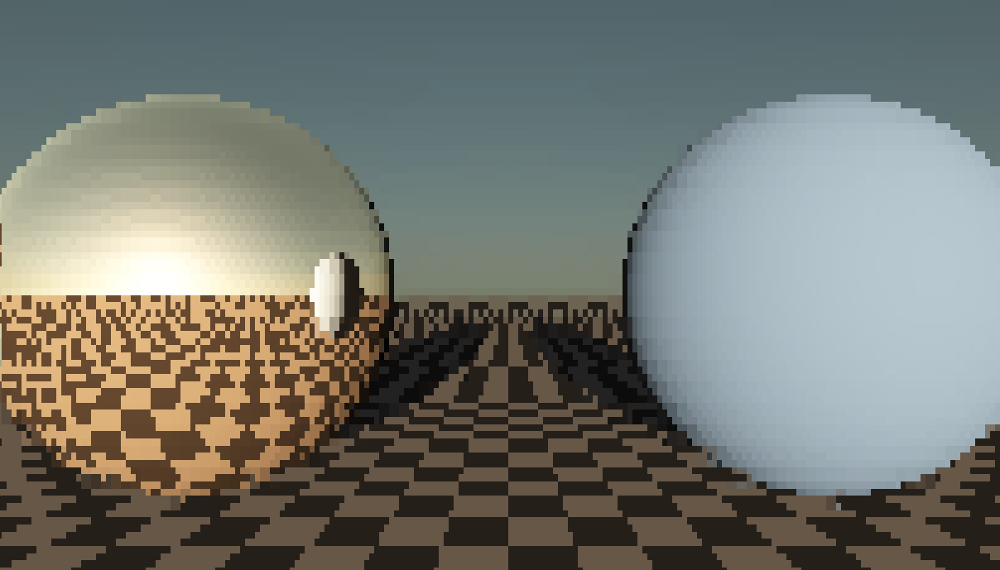

## rayterm

**rayterm** is a ray-tracer that renders its output to a terminal.
The only dependencies are [notcurses](https://github.com/dankamongmen/notcurses) and [SDL3](https://github.com/libsdl-org/SDL)---both optional.

## gallery



## features

- Written in C23
- Real-time path tracing on the terminal
- Supports ASCII (monochrome/colored/matrix) and UTF-8 block output
- Atmospheric scattering
- Supported primitives: planes, spheres
- Supported materials: emissive, diffuse, metallic, dielectric, checkerboard
- Supported lights: directional, point
- First-person camera
- Keyboard support via notcurses
- Joystick support via SDL3
- Custom allocator support
- Callback-based error-handling

## building

Install [git](https://git-scm.com/), [premake](https://premake.github.io/) and the dependencies.

Then:

```
git clone https://github.com/0xdeadf1sh/rayterm
cd rayterm
premake5 gmake # this is for linux; see platform-specific instructions in premake's documentation
make -C build config=release
```

Now you may run the `shapes` demo:

`./build/release/shapes_notcurses`

Enjoy!

## license

```
rayterm: a ray-tracer with a tui
Copyright (C) 2026  0xdeadf1.sh

This program is free software: you can redistribute it and/or modify
it under the terms of the GNU General Public License as published by
the Free Software Foundation, either version 3 of the License, or
(at your option) any later version.

This program is distributed in the hope that it will be useful,
but WITHOUT ANY WARRANTY; without even the implied warranty of
MERCHANTABILITY or FITNESS FOR A PARTICULAR PURPOSE.  See the
GNU General Public License for more details.

You should have received a copy of the GNU General Public License
along with this program.  If not, see <https://www.gnu.org/licenses/>.
```
